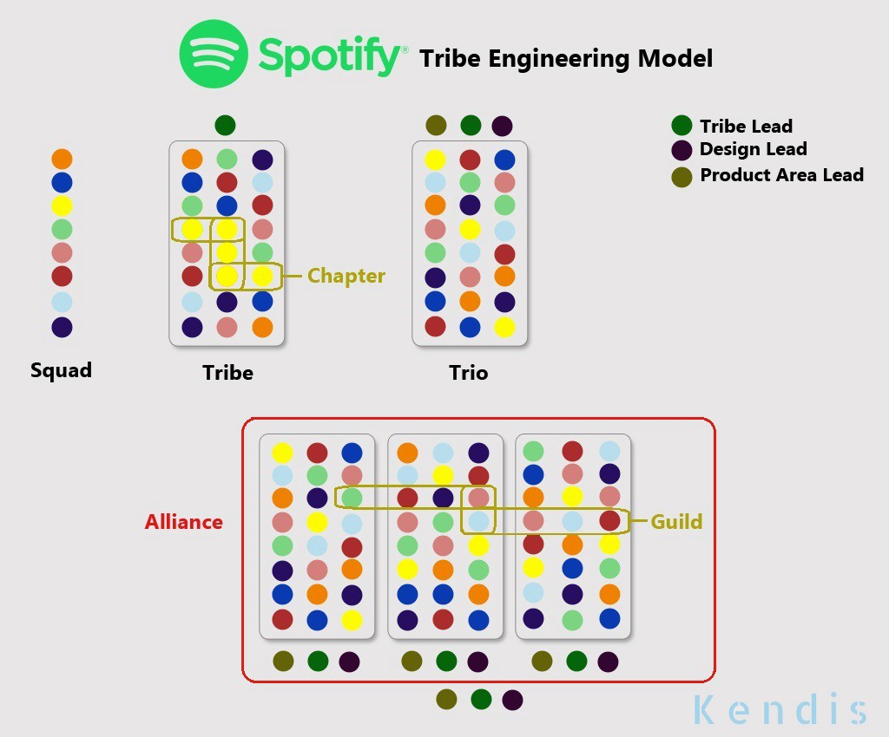

# 💻📖 hacker-laws

**개발자에게 유용한 법칙, 이론, 원칙, 그리고 패턴들**

 

<!-- vim-markdown-toc GFM -->

* [서론](#서론)
* [법칙](#법칙)
    * [암달의 법칙](#암달의-법칙)
    * [브룩스의 법칙](#브룩스의-법칙)
    * [콘웨이의 법칙](#콘웨이의-법칙)
    * [핸런의 면도날](#핸런의-면도날)
    * [호프스태터의 법칙](#호프스태터의-법칙)
    * [하이프 사이클 & 아마라의 법칙](#하이프-사이클—아마라의-법칙)
    * [하이럼의 법칙 (암시적 인터페이스의 법칙)](#하이럼의-법칙-암시적-인터페이스의-법칙)
    * [무어의 법칙](#무어의-법칙)
    * [파킨슨의 법칙](#파킨슨의-법칙)
    * [푸트의 법칙](#푸트의-법칙)
    * [The Law of Conservation of Complexity (Tesler's Law)](#the-law-of-conservation-of-complexity-teslers-law)
    * [허술한 추상화의 법칙](#허술한-추상화의-법칙)
    * [The Law of Triviality](#the-law-of-triviality)
    * [The Unix Philosophy](#the-unix-philosophy)
    * [스포티파이 모델](#스포티파이-모델)
    * [Wadler's Law](#wadlers-law)
* [Principles](#principles)
    * [The Pareto Principle (The 80/20 Rule)](#the-pareto-principle-the-8020-rule)
    * [The Robustness Principle (Postel's Law)](#the-robustness-principle-postels-law)
    * [SOLID](#solid)
    * [The Single Responsibility Principle](#the-single-responsibility-principle)
    * [The Open/Closed Principle](#the-openclosed-principle)
    * [The Liskov Substitution Principle](#the-liskov-substitution-principle)
    * [The Interface Segregation Principle](#the-interface-segregation-principle)
    * [The Dependency Inversion Principle](#the-dependency-inversion-principle)
    * [The DRY Principle](#the-dry-principle)
* [추천 도서](#추천-도서)
* [TODO](#todo)

<!-- vim-markdown-toc -->

 

## 서론

개발을 이야기할 때 흔히 논하는 법칙들이 있습니다. 이 저장소는 그 중 가장 보편적인 것들에 대한 참조와 개요입니다. 공유와 PR 제출 부탁드려요!

❗: 이 저장소는 여러 법칙, 원칙, 그리고 패턴에 관한 설명을 포함하고 있지만, 그 중 어떤 것도  _지지_ 하고 있지 않습니다. 그것들을 적용하여야 할지에 말지에 대해서는 언제나 논의의 여지가 있으며, 또한 당신이 어떤 작업을 하느냐에 따라서도 크게 달라집니다.

 

## 법칙

### 암달의 법칙

[위키피디아의 암달의 법칙](https://ko.wikipedia.org/wiki/암달의_법칙)

> 암달의 법칙은 시스템에 리소스를 추가함으로써 얻을 수 있는 컴퓨터 작업 성능 향상의 최대 폭을 나타내주는 공식이다. 일반적으로 병렬 컴퓨팅에서 이를 이용하여, 프로세서 개수의 증가가 프로그램 자체의 구조적인 병렬화 제한에 맞서 실제적으로 가져다주는 이득을 예측할 수 있다.

예시를 살펴보자. 어떠한 프로그램이 단일 프로세서로 구동되어야 하는 부분 A와 병렬화될 수 있는 부분 B로 이루어져있다고 할 때, 우리는 프로세서의 추가가 제한된 이득만을 가져다줌을 알 수 있다. B 부분의 성능을 크게 향상시킬 수 있지만, A 부분의 속도는 그대로 남을 것이기 때문이다.

아래의 그래프는 성능 향상 가능성의 예시를 보여준다.

*(이미지 출처: Daniels220 @영어 Wikipedia, Creative Commons Attribution-Share Alike 3.0 Unported, https://en.wikipedia.org/wiki/File:AmdahlsLaw.svg)*

 

보다시피 50%나 병렬화 가능한 프로그램임에도 10개 프로세서 이후에는 거의 이득이 없는 반면, 95% 병렬화 가능한 프로그램은 수천 개가 추가될 때까지도 유의미한 성능 향상을 보여주고 있다.

[무어의 법칙](#무어의-법칙)과 개별 프로세서의 성능 증가 속도가 완화되면서, 병렬화는 최적화의 핵심이 되었다. 그래픽스 프로그래밍이 이에 대한 가장 알맞은 예시이다. 셰이더 기반의 최신 컴퓨팅에서는 개별 픽셀 혹은 프래그먼트를 병렬로 렌더링할 수 있는데, 이것이 최신 그래픽 카드들이 대개 수천 개의 코어(GPU 또는 셰이더 유닛)로 구성된 이유이다.

 

관련:

- [브룩스의 법칙](#브룩스의-법칙)
- [무어의 법칙](#무어의-법칙)

 

### 브룩스의 법칙

[위키피디아의 브룩스의 법칙](https://ko.wikipedia.org/wiki/브룩스의_법칙)

> 지체되는 소프트웨어 개발 프로젝트에 인력을 더하는 것은 개발을 늦출 뿐이다.

이 법칙은 이미 늦어지고 있는 소프트웨어 개발을 빨리하기 위해 사람을 더 투입하는 것은 도리어 완성을 늦출 뿐이라고 말한다. 브룩스는 이것은 비록 극도로 단순화한 이야기임을 분명히 했으나, 다만 일반적으로 보았을 때 자원 투입 시간과 의사소통 비용으로 인해 단기적으로 속도가 줄어들 수 있다고 하였다. 또한 많은 작업들은 분할할 수 없기 때문에, 즉 인력이 늘어난다고 하여 쉽게 분배할 수 없기 때문에, 기대할 수 있는 속도 증가 역시 낮다.

흔히 말하는 "임산부 9명이 모여도 아기를 한 달만에 낳을 수는 없다"는 구절은 브룩스의 법칙 중에서도, 특정 작업은 나누거나 병렬화할 수 없음을 비유적으로 뜻한다.

이것은 그의 저서 '[맨먼스 미신](#추천-도서)'의 주요한 주제이다.

 

관련:

- [Death March](#todo)
- [추천 도서 목록: 맨먼스 미신](#추천-도서)

 

### 콘웨이의 법칙

[Conway's Law on Wikipedia](https://en.wikipedia.org/wiki/Conway%27s_law)

이 법칙에 따르면 시스템의 구조는 설계하는 조직의 구조를 반영한다. 이것은 조직 개선을 시도할 때 종종 인용되고는 하는데, 가령 조직이 여러 개의 작고 끊어진 단위로 구성되어 있다면 거기에서 나온 소프트웨어 또한 그 모습을 닮는다고 한다. 또한 만약 조직이 기능과 서비스를 중심으로 수직적으로 짜여 있다면, 이 역시 소프트웨어가 이러한 모습을 반영할 것이란 것이다.

 관련:

- [스포티파이 모델](#스포티파이-모델)

 

### 핸런의 면도날

[위키피디아의 핸런의 면도날](https://ko.wikipedia.org/wiki/핸런의_면도날)

> 어리석음으로 충분히 설명이 되는 일을 악의의 탓으로 돌리지 말라.
>
> — 로버트 J. 핸런

이 법칙에 따르면 부정적인 결과를 낳는 행동은 악의로부터 비롯된 것이라기보다는, 행동과 그것이 불러올 파장에 대한 몰이해 때문이다.

 

### 호프스태터의 법칙

[Hofstadter's Law on Wikipedia](https://en.wikipedia.org/wiki/Hofstadter%27s_law)

> 설령 호프스태터의 법칙을 고려하더라도, 일은 마치는 건 언제나 예상보다 오래 걸린다.
>
> — 더글라스 호프스태터

무언가가 얼마나 걸릴지 짐작할 때 이 법칙을 인용하는 것을 들을 수 있을지 모른다. 뻔한 말 같지만, 우리는 소프트웨어를 개발함에 있어 결과를 내놓기까지의 기간을 예상하는 것에 그다지 능하지 않다.

이는 '[[괴델, 에셔, 바흐: 영원한 황금 노끈]](#추천-도서)'에서 나온 말이다.

 

관련:

- [추천 도서 목록: 괴델, 에셔, 바흐: 영원한 황금 노끈](#추천-도서)

 

### 하이프 사이클 & 아마라의 법칙

[위키피디아의 하이프 사이클](https://ko.wikipedia.org/wiki/하이프_사이클)

> 우리는 새로운 기술의 효과를 단기적으로는 과대평가하고, 장기적으로는 과소평가하는 경향이 있다.
>
> — 로이 아마라

하이프 사이클은 미국의 정보 기술 연구 및 자문 회사인 가트너에서 시간의 흐름에 따른 기술에 대한 기대와 성숙도를 시각적으로 나타낸 것이다.

 

*(이미치 출처: Jeremykemp @영어 Wikipedia, CC BY-SA 3.0, https://commons.wikimedia.org/w/index.php?curid=10547051)*

 

즉, 이 사이클에 따르면 대개 신기술과 그 전망에 대하여 거품이 촉발된다. 이때 많은 팀들은 너무 빠르게 뛰어들었다가 결과물에 종종 실망하고는 한다. 이것은 어쩌면 기술이 아직 덜 성숙하기 때문이거나, 혹은 실제 세계에의 적용이 덜 이루어졌기 때문일 것이다.

특정 시점이 지나고 나면 기술 자체의 역량과 실제적인 적용의 기회가 늘어나고, 마침내 생산성을 얻을 수 있게 된다. 로이 아마라는 이를 가장 간결한 문장으로 정리하였다. "우리는 새로운 기술의 효과를 단기적으로는 과대평가하고, 장기적으로는 과소평가하는 경향이 있다".

 

### 하이럼의 법칙 (암시적 인터페이스의 법칙)

[Hyrum's Law Online](http://www.hyrumslaw.com/)

> API에 충분한 수의 유저가 있다면,
>
> 명세에서 지정된 것은 아무런 상관이 없다:
>
> 시스템에서 관측될 수 있는 모든 행동 양식은
>
> 다른 이들에게 달려있을 것이다.
>
> — 하이럼 라이트
>
> (Hyrum Wright)

하이럼의 법칙에 따르면 API에 충분히 많은 수의 소비자가 있을 때, API의 모든 행동 양식은 궁극적으로 명세에 있는 정의가 아닌 아닌 다른 누군가에게 달려있게 된다. 간단한 예시를 들자면 가령 API의 응답 시간과도 같은 비함수적 요소들이다. 좀 더 구체적인 예시는 에러 메세지에 정규 표현식을 이용하여 API의 에러의 *타입* 을 알아내는 소비자들을 들 수 있다. API의 공개 명세에서는 메세지의 내용에 관하여서 아무 것도 알려주지 않으며 대신 에러 코드를 사용해야 한다고 하고 있더라도, 어떤 유저들은 메세지를 사용하거나 메세지의 내용을 변경하여 API를 사실상 붕괴시킬 수 있다.

 

관련:

- [허술한 추상화의 법칙](#허술한-추상화의-법칙)
- [XKCD 1172](https://xkcd.com/1172/)

 

### 무어의 법칙

[위키피디아의 무어의 법칙](https://ko.wikipedia.org/wiki/무어의_법칙)

> 집적 회로의 트랜지스터 수는 대략 2년마다 2배가 된다.

반도체와 기판 기술의 가파른 성장 속도를 설명하기 위한 무어의 예측은 1970년대부터 2000년대 후반까지 굉장히 정확한 것으로 드러났다. 최근에는 [부품 소형화의 물리적 한계](https://ko.wikipedia.org/wiki/터널_효과)로 인하여 약간 둔화되긴 하였지만 말이다. 하지만 병렬화와 반도체 기술의 혁신적 변화에 대한 가능성, 그리고 양자 컴퓨팅은 무어의 법칙이 향후 몇 십 년간에도 들어맞을 수 있음을 의미할 수도 있다. 

### 파킨슨의 법칙

[Parkinson's Law on Wikipedia](https://en.wikipedia.org/wiki/Parkinson%27s_law)

> 작업은 남은 기한을 채울 때까지 늘어난다.

원래 맥락에서 이 법칙은 관료제에 대한 연구를 기반으로 하고 있다. 소프트웨어 개발 계획에서도 비관적으로 적용될 수 있는데, 개발자들은 기한이 다가오기 전에는 효율적이지 못하다가 기한이 가까워지면 급하게 일을 하게 되므로 결국 실제적인 데드라인을 흐릿하게 한다.

만일 이 법칙이 [호프스태터의 법칙](#호프스태터의-법칙)과 결합된다면, 더욱 비관적인 관점에 도달할 수 있다. 작업은 남은 시간을 채우기 위해 늘어나면서도 *예정된 시간보다 길어지기까지 할 것이다.*

 관련:

- [호프스태터의 법칙](#호프스태터의-법칙)

 

### 푸트의 법칙

[Putt's Law on Wikipedia](https://en.wikipedia.org/wiki/Putt%27s_Law_and_the_Successful_Technocrat)

> 기술은, 자신이 관리하지 않는 것들을 이해하는 자들과, 자신이 관리하는 것들을 이해하지 못하는 자들 두 가지 분류의 사람들에 의해 지배된다.

푸트의 법칙에는 종종 다음 푸트의 귀결이 따라붙는다:

> 모든 기술 조직의 계급에서는 시간이 흐르면서 역량의 역전이 일어난다.

이 문구에 따르면 조직 구성론에 대한 여러 가지 선택 기준과 유행 변화에 따라서, 조직에는 여러 명의 숙련된 노동 계층과 자신들이 관리하는 일의 복잡도와 어려움을 모르는 여러 명의 관리직이  생기게 된다. 이것은 [피터의 원리](#TODO) 혹은 [딜버트의 법칙](#TODO)과도 같은 현상 때문이다.

다만 이런 류의 법칙에서 잊지 말아야 할 점은 이러한 모호한 일반화는 _어떠한_ 조직에는 적용될 수도 있으나, 나머지에는 아니라는 점이다.

 

관련:

- [피터의 원리](#TODO)
- [딜버트의 법칙](#TODO)

 

### The Law of Conservation of Complexity (Tesler's Law)

[The Law of Conservation of Complexity on Wikipedia](https://en.wikipedia.org/wiki/Law_of_conservation_of_complexity)

This law states that there is a certain amount of complexity in a system which cannot be reduced.

Some complexity in a system is 'inadvertent'. It is a consequence of poor structure, mistakes, or just bad modeling of a problem to solve. Inadvertent complexity can be reduced (or eliminated). However, some complexity is 'intrinsic' as a consequence of the complexity inherent in the problem being solved. This complexity can be moved, but not eliminated.

One interesting element to this law is the suggestion that even by simplifying the entire system, the intrinsic complexity is not reduced, it is _moved to the user_, who must behave in a more complex way.

 

### 허술한 추상화의 법칙

[The Law of Leaky Abstractions on Joel on Software](https://www.joelonsoftware.com/2002/11/11/the-law-of-leaky-abstractions/)

> All non-trivial abstractions, to some degree, are leaky.
>
> (Joel Spolsky)

This law states that abstractions, which are generally used in computing to simplify working with complicated systems, will in certain situations 'leak' elements of the underlying system, this making the abstraction behave in an unexpected way.

An example might be loading a file and reading its contents. The file system APIs are an _abstraction_ of the lower level kernel systems, which are themselves an abstraction over the physical processes relating to changing data on a magnetic platter (or flash memory for an SSD). In most cases, the abstraction of treating a file like a stream of binary data will work. However, for a magnetic drive, reading data sequentially will be *significantly* faster than random access (due to increased overhead of page faults), but for an SSD drive, this overhead will not be present. Underlying details will need to be understood to deal with this case (for example, database index files are structured to reduce the overhead of random access), the abstraction 'leaks' implementation details the developer may need to be aware of.

The example above can become more complex when _more_ abstractions are introduced. The Linux operating system allows files to be accessed over a network but represented locally as 'normal' files. This abstraction will 'leak' if there are network failures. If a developer treats these files as 'normal' files, without considering the fact that they may be subject to network latency and failures, the solutions will be buggy.

The article describing the law suggests that an over-reliance on abstractions, combined with a poor understanding of the underlying processes, actually makes dealing with the problem at hand _more_ complex in some cases.

See also:

- [Hyrum's Law](#hyrums-law-the-law-of-implicit-interfaces)

Real-world examples:

- [Photoshop Slow Startup](https://forums.adobe.com/thread/376152) - an issue I encountered in the past. Photoshop would be slow to startup, sometimes taking minutes. It seems the issue was that on startup it reads some information about the current default printer. However, if that printer is actually a network printer, this could take an extremely long time. The _abstraction_ of a network printer being presented to the system similar to a local printer caused an issue for users in poor connectivity situations.

### The Law of Triviality

[The Law of Triviality on Wikipedia](https://en.wikipedia.org/wiki/Law_of_triviality)

This law suggests that groups will give far more time and attention to trivial or cosmetic issues rather than serious and substantial ones.

The common fictional example used is that of a committee approving plans for nuclear power plant, who spend the majority of their time discussing the structure of the bike shed, rather than the far more important design for the power plant itself. It can be difficult to give valuable input on discussions about very large, complex topics without a high degree of subject matter expertise or preparation. However, people want to be seen to be contributing valuable input. Hence a tendency to focus too much time on small details, which can be reasoned about easily, but are not necessarily of particular importance.

The fictional example above led to the usage of the term 'Bike Shedding' as an expression for wasting time on trivial details.

### The Unix Philosophy

[The Unix Philosophy on Wikipedia](https://en.wikipedia.org/wiki/Unix_philosophy)

The Unix Philosophy is that software components should be small, and focused on doing one specific thing well. This can make it easier to build systems by composing together small, simple, well-defined units, rather than using large, complex, multi-purpose programs.

Modern practices like 'Microservice Architecture' can be thought of as an application of this law, where services are small, focused and do one specific thing, allowing complex behaviour to be composed of simple building blocks.

 

### 스포티파이 모델

[The Spotify Model on Spotify Labs](https://labs.spotify.com/2014/03/27/spotify-engineering-culture-part-1/)

스포티파이 모델은 '스포티파이'에 의해 유명해진 팀과 조직 구조에 대한 접근법이다. 이 모델에서 팀은 기술보단 기능을 중심으로 구성된다.

스포티파이 모델은 부족, 길드, 지부와 같은 그들 조직 구조의 요소 또한 유명하게 만들었다.

 

*(이미지 출처: https://medium.com/@media_75624/exploring-key-elements-of-spotifys-agile-scaling-model-471d2a23d7ea)*

 

### Wadler's Law

[Wadler's Law on wiki.haskell.org](https://wiki.haskell.org/Wadler's_Law)

> In any language design, the total time spent discussing a feature in this list is proportional to two raised to the power of its position.
> 
> 0. Semantics
> 1. Syntax
> 2. Lexical syntax
> 3. Lexical syntax of comments
> 
> (In short, for every hour spent on semantics, 8 hours will be spent on the syntax of comments).

Similar to [The Law of Triviality](#the-law-of-triviality), Wadler's Law states what when designing a language, the amount of time spent on language structures is disproportionately high in comparison to the importance of those features.

See also:

- [The Law of Triviality](#the-law-of-triviality)

## Principles

Principles are generally more likely to be guidelines relating to design.

### The Pareto Principle (The 80/20 Rule)

[The Pareto Principle on Wikipedia](https://en.wikipedia.org/wiki/Pareto_principle)

> Most things in life are not distributed evenly.

The Pareto Principle suggests that in some cases, the majority of results come from a minority of inputs:

- 80% of a certain piece of software can be written in 20% of the total allocated time (conversely, the hardest 20% of the code takes 80% of the time)
- 20% of the effort produces 80% of the result
- 20% of the work creates 80% of the revenue
- 20% of the bugs cause 80% of the crashes
- 20% of the features cause 80% of the usage

In the 1940s American-Romanian engineer Dr. Joseph Juran, who is widely credited with being the father of quality control, [began to apply the Pareto principle to quality issues](https://en.wikipedia.org/wiki/Joseph_M._Juran).

This principle is also known as: The 80/20 Rule, The Law of the Vital Few and The Principle of Factor Sparsity.

Real-world examples:

- In 2002 Microsoft reported that by fixing the top 20% of the most-reported bugs, 80% of the related errors and crashes in windows and office would become eliminated ([Reference](https://www.crn.com/news/security/18821726/microsofts-ceo-80-20-rule-applies-to-bugs-not-just-features.htm)).

### The Robustness Principle (Postel's Law)

[The Robustness Principle on Wikipedia](https://en.wikipedia.org/wiki/Robustness_principle)

> Be conservative in what you do, be liberal in what you accept from others.

Often applied in server application development, this principle states that what you send to others should be as minimal and conformant as possible, but you should be aim to allow non-conformant input if it can be processed.

The goal of this principle is to build systems which are robust, as they can handle poorly formed input if the intent can still be understood. However, there are potentially security implications of accepting malformed input, particularly if the processing of such input is not well tested.

### SOLID

This is an acronym, which refers to:

* S: [The Single Responsibility Principle](#the-single-responsibility-principle)
* O: [The Open/Closed Principle](#the-openclosed-principle)
* L: [The Liskov Substitution Principle](#the-liskov-substitution-principle)
* I: [The Interface Segregation Principle](#the-interface-segregation-principle)
* D: [The Dependency Inversion Principle](#the-dependency-inversion-principle)

These are key principles in [Object-Oriented Programming](#todo). Design principles such as these should be able to aid developers build more maintainable systems.

### The Single Responsibility Principle

[The Single Responsibility Principle on Wikipedia](https://en.wikipedia.org/wiki/Single_responsibility_principle)

> Every module or class should have a single responsibility only.

The first of the '[SOLID](#solid)' principles. This principle suggests that modules or classes should do one thing and one thing only. In more practical terms, this means that a single, small change to a feature of a program should require a change in one component only. For example, changing how a password is validated for complexity should require a change in only one part of the program.

Theoretically, this should make the code more robust, and easier to change. Knowing that a component which is being changed has a single responsibility only means that _testing_ that change should be easier. Using the earlier example, changing the password complexity component should only be able to affect the features which relate to password complexity. It can be much more difficult to reason about the impact of a change to a component which has many responsibilities.

See also:

- [Object-Oriented Programming](#todo)
- [SOLID](#solid)

### The Open/Closed Principle

[The Open/Closed Principle on Wikipedia](https://en.wikipedia.org/wiki/Open%E2%80%93closed_principle)

> Entities should be open for extension and closed for modification.

The second of the '[SOLID](#solid)' principles. This principle states that entities (which could be classes, modules, functions and so on) should be able to have their behaviour _extended_, but that their _existing_ behaviour should not be able to be modified.

As a hypothetical example, imagine a module which is able to turn a Markdown document into HTML. If the module could be extended to handle a newly proposed markdown feature, without modifying the module internals, then it would be open for extension. If the module could _not_ be modified by a consumer so that how existing Markdown features are handled, then it would be _closed_ for modification.

This principle has particular relevance for object-oriented programming, where we may design objects to be easily extended, but would avoid designing objects which can have their existing behaviour changed in unexpected ways.

See also:

- [Object-Oriented Programming](#todo)
- [SOLID](#solid)

### The Liskov Substitution Principle

[The Liskov Substitution Principle on Wikipedia](https://en.wikipedia.org/wiki/Liskov_substitution_principle)

> It should be possible to replace a type with a subtype, without breaking the system.

The third of the '[SOLID](#solid)' principles. This principle states that if a component relies on a type, then it should be able to use subtypes of that type, without the system failing or having to know the details of what that subtype is.

As an example, imagine we have a method which reads an XML document from a structure which represents a file. If the method uses a base type 'file', then anything which derives from 'file' should be able to be used in the function. If 'file' supports seeking in reverse, and the XML parser uses that function, but the derived type 'network file' fails when reverse seeking is attempted, then the 'network file' would be violating the principle.

This principle has particular relevance for object-oriented programming, where type hierarchies must be modeled carefully to avoid confusing users of a system.

See also:

- [Object-Oriented Programming](#todo)
- [SOLID](#solid)

### The Interface Segregation Principle

[The Interface Segregation Principle on Wikipedia](https://en.wikipedia.org/wiki/Interface_segregation_principle)

> No client should be forced to depend on methods it does not use.

The fourth of the '[SOLID](#solid)' principles. This principle states that consumers of a component should not depend on functions of that component which it doesn't actually use.

As an example, imagine we have a method which reads an XML document from a structure which represents a file. It only needs to read bytes, move forwards or move backwards in the file. If this method needs to be updated because an unrelated feature of the file structure changes (such as an update to the permissions model used to represent file security), then the principle has been invalidated. It would be better for the file to implement a 'seekable-stream' interface, and for the XML reader to use that.

This principle has particular relevance for object-oriented programming, where interfaces, hierarchies and abstract types are used to [minimise the coupling](#todo) between different components. [Duck typing](#todo) is a methodology which enforces this principle by eliminating explicit interfaces.

See also:

- [Object-Oriented Programming](#todo)
- [SOLID](#solid)
- [Duck Typing](#todo)
- [Decoupling](#todo)

### The Dependency Inversion Principle

[The Dependency Inversion Principle](https://en.wikipedia.org/wiki/Dependency_inversion_principle)

> High-level modules should not be dependent on low-level implementations.

The fifth of the '[SOLID](#solid)' principles. This principle states that higher level orchestrating components should not have to know the details of their dependencies.

As an example, imagine we have a program which read metadata from a website. We would assume that the main component would have to know about a component to download the webpage content, then a component which can read the metadata. If we were to take dependency inversion into account, the main component would depend only on an abstract component which can fetch byte data, and then an abstract component which would be able to read metadata from a byte stream. The main component would not know about TCP/IP, HTTP, HTML, etc.

This principle is complex, as it can seem to 'invert' the expected dependencies of a system (hence the name). In practice, it also means that a separate orchestrating component must ensure the correct implementations of abstract types are used (e.g. in the previous example, _something_ must still provide the metadata reader component a HTTP file downloader and HTML meta tag reader). This then touches on patterns such as [Inversion of Control](#todo) and [Dependency Injection](#todo).

See also:

- [Object-Oriented Programming](#todo)
- [SOLID](#solid)
- [Inversion of Control](#todo)
- [Dependency Injection](#todo)

### The DRY Principle

[The DRY Principle on Wikipedia](https://en.wikipedia.org/wiki/Don%27t_repeat_yourself)

> Every piece of knowledge must have a single, unambiguous, authoritative representation within a system.

DRY is an acronym for _Don't Repeat Yourself_. This principle aims to help developers reducing the repetition of code and keep the information in a single place and was cited in 1999 by Andrew Hunt and Dave Thomas in the book [The Pragmatic Developer](https://en.wikipedia.org/wiki/The_Pragmatic_Programmer)

> The opposite of DRY would be _WET_ (Write Everything Twice or We Enjoy Typing).

In practice, if you have the same piece of information in two (or more) different places, you can use DRY to merge them into a single one and reuse it wherever you want/need.

See also:

- [The Pragmatic Developer](https://en.wikipedia.org/wiki/The_Pragmatic_Programmer)

 

## 추천 도서

이 개념들이 흥미롭다면, 다음 책들도 즐길 수 있을 것입니다.

- [맨먼스 미신 - 프레드릭 P. 브룩스 Jr.](https://www.goodreads.com/book/show/13629.The_Mythical_Man_Month) - 소프트웨어 공학의 고전. [브룩스의 법칙](#브룩스의-법칙)은 이 책의 주요한 주제이다.
- [괴델, 에셔, 바흐: 영원한 황금 노끈 - 더글라스 R. 호프스태터](https://www.goodreads.com/book/show/24113.G_del_Escher_Bach) - 이 책은 분류하기 어렵다. [호프스태터의 법칙](#호프스태터의-법칙)은 이 책으로부터 비롯되었다.

 

## TODO

Hi! If you land here, you've clicked on a link to a topic I've not written up yet, sorry about this - this is work in progress!

Feel free to [Raise an Issue](https://github.com/dwmkerr/hacker-laws/issues) requesting more details, or [Open a Pull Request](https://github.com/dwmkerr/hacker-laws/pulls) to submit your proposed definition of the topic.